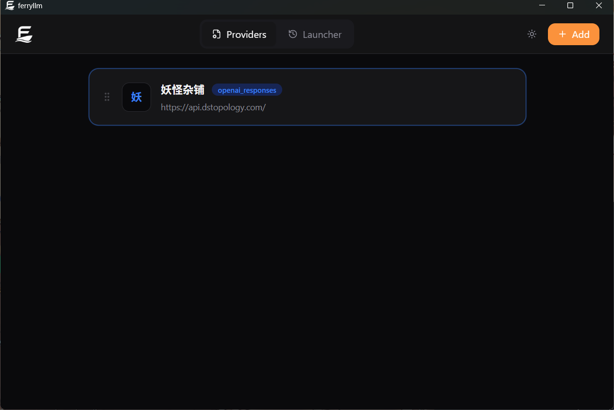
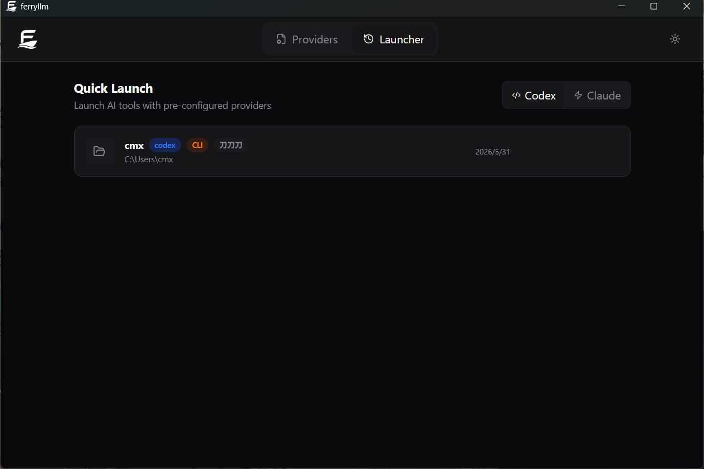
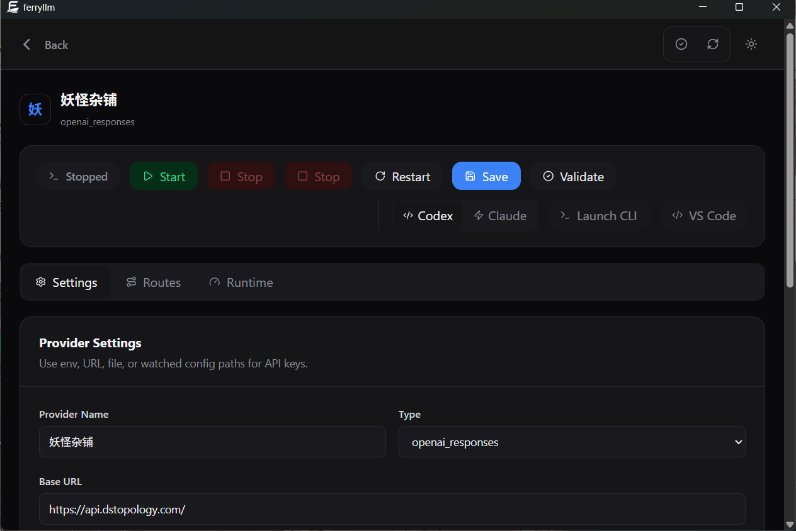

# ferryllm

面向 Codex、Claude Code、OpenCode、OpenAI、Anthropic 和 OpenAI-compatible 后端的桌面优先 LLM 网关与启动器。

[](https://github.com/caomengxuan666/ferryllm/actions/workflows/ci.yml)
[](https://crates.io/crates/ferryllm)
[](https://docs.rs/ferryllm)
[](LICENSE)

ferryllm 是一个原生桌面控制台，背后是 Rust 编写的 LLM 协议网关。GUI 是主要工作流：配置 provider、启动本地网关、查看运行指标、把客户端可见模型名映射到上游真实模型，并用正确环境启动 Codex、Claude Code、OpenCode 或 VS Code。

CLI 和 GUI 都只是同一个核心网关引擎的壳。协议转换、路由、prompt-cache 处理、reasoning 策略和 provider adapter 都在 Rust core 里，避免桌面端和命令行各自维护一套业务逻辑。

## 它能做什么

- 提供 Tauri 桌面应用：Dashboard、Providers、Launcher、Usage Logs 和 Settings
- 内置 provider presets、provider 测试、best-effort 用量探测和 `/v1/models` 模型发现
- 启动 Codex、Claude Code、OpenCode 和 VS Code，并自动指向本地网关
- 记住 workspace、provider 绑定、最近启动记录和本地 AI session
- 提供 OpenAI-compatible 入口：`POST /v1/chat/completions`
- 提供 OpenAI Responses API 入口：`POST /v1/responses`
- 提供 Anthropic-compatible 入口：`POST /v1/messages`
- 支持模型别名、精确路由、前缀路由和用户可编辑模型映射
- 支持转发到 OpenAI-compatible、OpenAI Responses、Anthropic，或可选 Gemini 后端
- 保留工具调用和 SSE 流式行为
- 向上游透传或合成 `User-Agent`
- 在清理 transport metadata 的同时保持 prompt-cache 前缀稳定
- 支持 configurable reasoning policy：preserve、fill missing、cap、force

## 为什么是 ferryllm

很多网关最终都会变成 `N x M` 矩阵：每一种客户端协议都要为每一种 provider 协议写一套适配。

ferryllm 采用 `N + M` 路由方式：

```text
客户端协议 -> ferryllm IR -> provider 协议
```

这样更适合下面这些场景：

- 在 GUI 里操作网关，而不是每次都手写 TOML
- 把 Claude Code 放到稳定的后端之上
- 用一个本地网关同时服务多种客户端协议
- 让缓存行为保持可预测
- 新增 provider 时不需要重写所有客户端路径

## 快速开始

推荐路径：从
[GitHub Releases](https://github.com/caomengxuan666/ferryllm/releases/latest)
安装桌面端。

- Windows：下载并运行 `.exe` 或 `.msi` 安装包。
- macOS：下载并打开 `.dmg`。
- Linux：下载并安装 `.deb`。

打开应用后，从 preset grid 或 custom form 添加 provider，测试 provider，如果 provider 支持 `/v1/models` 就拉取模型列表，设置模型映射，然后从 GUI 启动网关。应用运行的仍是同一个 core engine：

```bash
ferryllm serve --config <generated-config.toml>
```

如果只需要 CLI，也可以从 crates.io 安装：

```bash
cargo install ferryllm
```

这只会安装 `ferryllm` 网关 CLI，不包含桌面应用。

从源码运行：

```bash
git clone https://github.com/caomengxuan666/ferryllm.git
cd ferryllm
cargo run --features http --bin ferryllm -- serve --config examples/config/codexapis.toml
```

设置 provider key 并启动：

```bash
export CODX_API_KEY="your-api-key"
RUST_LOG=info ferryllm serve --config examples/config/codexapis.toml
```

测试 Anthropic-compatible endpoint：

```bash
curl -s http://127.0.0.1:3000/v1/messages \
  -H 'content-type: application/json' \
  -H 'authorization: Bearer local-test-token' \
  -d '{"model":"cc-gpt55","max_tokens":64,"messages":[{"role":"user","content":"hello"}]}'
```

## Claude Code 代理场景

Claude Code 发送的是 Anthropic 格式请求。ferryllm 可以接收这类请求，重写模型名，再转发给 OpenAI-compatible 后端。

```text
Claude Code
  -> POST /v1/messages, model = claude-*
  -> ferryllm Anthropic entry
  -> unified IR
  -> route match: claude-
  -> rewrite backend model: gpt-5.4
  -> OpenAI-compatible backend
```

启动 ferryllm：

```bash
export CODX_API_KEY="your-api-key"
RUST_LOG=ferryllm=info,tower_http=info \
  ferryllm serve --config examples/config/codexapis.toml
```

让 Claude Code 指向 ferryllm：

```bash
ANTHROPIC_API_KEY=dummy \
ANTHROPIC_BASE_URL=http://127.0.0.1:3000 \
claude --bare --print --model claude-opus-4-6 \
  "Reply with exactly one short word: pong"
```

预期输出：

```text
pong
```

## 桌面 GUI

桌面端是 ferryllm 的主要使用入口。



它包含：

- **Launcher**：项目列表、新建/打开 workspace、项目绑定 provider、项目级 reasoning 选择、启动 Codex/Claude/OpenCode、启动 VS Code、恢复 session。
- **Providers**：logo preset grid、自定义 provider、provider test、用量探测、复制/删除、key source 状态、模型映射、从 provider 模型端点发现模型。
- **Dashboard**：网关状态、health/readiness、请求量、成功/错误数、延迟、缓存命中率、provider/model 表、prompt-cache 条和最近日志。
- **Usage Logs**：把最近网关日志和 launcher 事件放到一个表里。
- **Settings**：运行时限制、retry/circuit breaker、reasoning policy、auth、prompt-cache、logging 和桌面偏好。

打开应用后，配置 provider，保存配置并启动网关。GUI 会写入可运行的 TOML 配置，然后启动：

```bash
ferryllm serve --config <generated-config.toml>
```

打包后的应用会优先查找内置的 `ferryllm` sidecar，找不到时再使用 `PATH`
里的 `ferryllm`。Launcher 会启动 Codex、Claude Code、OpenCode 或 VS Code，并把
`OPENAI_BASE_URL`、`ANTHROPIC_BASE_URL`、模型 alias 和 reasoning 默认值指向本地网关。





更多 Claude Code 和 cc-switch 配置见 [docs/claude-code.md](docs/claude-code.md)。

## 配置

ferryllm 使用 TOML 配置，密钥通过环境变量注入。

```toml
[server]
listen = "0.0.0.0:3000"
request_timeout_secs = 120
body_limit_mb = 32
reasoning_policy = "fill_missing"
default_reasoning_effort = "medium"
# Optional. 当 reasoning_policy = "cap" 时，阻止客户端超过该档位。
# max_reasoning_effort = "high"
# Optional. Uncomment to cap in-flight requests.
# max_concurrent_requests = 128
# Optional. Uncomment to cap total requests per minute.
# rate_limit_per_minute = 600
# Optional non-streaming upstream resilience. Streaming requests are not retried.
# retry_attempts = 2
# retry_backoff_ms = 100
# circuit_breaker_failures = 5
# circuit_breaker_cooldown_secs = 30

[logging]
level = "info"
format = "text"
ansi = false

[auth]
enabled = false
# api_keys_env = "FERRYLLM_API_KEYS"
# Optional per-client caps, keyed by the authenticated API key.
# per_key_rate_limit_per_minute = 120
# per_key_max_concurrent_requests = 8

[metrics]
enabled = true

[prompt_cache]
auto_inject_anthropic_cache_control = true
cache_system = true
cache_tools = true
cache_last_user_message = true
openai_prompt_cache_key = "ferryllm"
# openai_prompt_cache_retention = "24h"
debug_log_request_shape = true
relocate_system_prefix_range = "0..1"
log_relocated_system_text = false
strip_system_line_prefixes = ["x-anthropic-billing-header:"]

[[providers]]
name = "codexapis"
# 目前控制思考强度的默认路径。
type = "openai_responses"
base_url = "https://codexapis.com"
api_key_env = "CODX_API_KEY"
# 如果你想继续使用旧的 Chat Completions 路径，把这里改回：
# type = "openai"

# 或者使用 key_watch 从外部配置文件热加载 API key：
# [[providers.key_watch]]
# file = "C:/Users/hzz/.claude/settings.json"
# path = "env.ANTHROPIC_AUTH_TOKEN"

[[routes]]
match = "cc-gpt55"
match_type = "exact"
provider = "codexapis"
rewrite_model = "gpt-5.4"

[[routes]]
match = "claude-"
provider = "codexapis"
rewrite_model = "gpt-5.4"

[[routes]]
match = "gpt-"
provider = "codexapis"

[[routes]]
match = "grok-"
provider = "codexapis"

[[routes]]
match = "*"
provider = "codexapis"
rewrite_model = "gpt-5.4"
```

不启动服务也可以检查配置：

```bash
ferryllm check-config --config examples/config/codexapis.toml
```

如需热加载 API key 配置（例如从 cc-switch 设置），请参阅配置文档中的 [key_watch](docs/configuration.md#key-watch-hot-reload-api-keys) 部分。

如果要让 OpenAI-compatible 上游走 Responses API，而不是 Chat Completions，
把 provider type 改成 `openai_responses` 即可。默认构建，包括
`cargo install ferryllm`，已经包含这个 adapter。如果你使用
`--no-default-features` 自定义构建，则需要显式开启 `openai-responses`：

```bash
cargo build --release --features http,prompt-observability,openai-responses --bin ferryllm
```

```toml
[[providers]]
name = "codexapis"
type = "openai_responses"
base_url = "https://codexapis.com"
api_key_env = "CODX_API_KEY"
```

示例见 [examples/config/codexapis-responses.toml](examples/config/codexapis-responses.toml)。

## 思考强度

可以在 TOML 或 GUI Settings 里配置模型思考强度：

```toml
[server]
reasoning_policy = "cap"
default_reasoning_effort = "medium"
max_reasoning_effort = "high"
```

可选 effort 值是 `none`、`minimal`、`low`、`medium`、`high`、`xhigh`、`max` 和 `ultracode`。

`reasoning_policy` 决定 ferryllm 如何处理客户端传来的 reasoning：

- `preserve`：完全尊重客户端。
- `fill_missing`：客户端没传时才填 `default_reasoning_effort`。
- `cap`：客户端可以调，但不能超过 `max_reasoning_effort`。
- `force`：无论客户端传什么，都强制使用 `default_reasoning_effort`。

Launcher 也可以给项目设置 reasoning 档位，并在启动 Codex/Claude Code 时传给客户端。网关仍然会应用服务端策略，所以 GUI 启动和直接 CLI 请求都受同一套 core 规则约束。

`info` 日志会打印 `requested_reasoning` 和 `applied_reasoning`。开启 request-shape debug 后，还能看到出站 `reasoning=effort=...` 或 Anthropic thinking budget 摘要。

## 接口

| Endpoint | 用途 |
| --- | --- |
| `POST /v1/chat/completions` | OpenAI-compatible chat completions |
| `POST /v1/responses` | OpenAI Responses API |
| `POST /responses` | Responses API 兼容别名 |
| `POST /v1/messages` | Anthropic-compatible messages |
| `GET /v1/models` | OpenAI-compatible model listing |
| `GET /health` | 简单健康检查 |
| `GET /healthz` | Kubernetes 风格 liveness check |
| `GET /readyz` | readiness check |
| `GET /metrics` | 带 provider/model 标签的 Prometheus 风格 metrics |

## Prompt Cache

ferryllm 会在清理 transport metadata 的同时保持 prompt-cache 前缀稳定。

开启 `prompt-observability` 后，ferryllm 会把 prompt-cache 使用情况写入日志和 `/metrics`。

对 Claude Code 场景，最重要的几个参数是：

- `relocate_system_prefix_range`
- `strip_system_line_prefixes`
- `openai_prompt_cache_key`
- `default_reasoning_effort`
- `reasoning_policy`
- `max_reasoning_effort`

详见 [docs/prompt-caching.md](docs/prompt-caching.md) 和 [docs/reasoning-control.md](docs/reasoning-control.md)。

## 项目结构

```text
desktop/            Tauri GUI、launcher、dashboard、provider editor
src/
  adapter.rs        Adapter trait
  ir.rs             统一请求、响应、内容块、工具和流式事件类型
  router.rs         精确和前缀路由
  server.rs         Axum HTTP server
  config.rs         TOML 配置加载和校验
  entry/            客户端协议转换
  adapters/         后端 provider adapter
```

更多细节见 [docs/architecture.md](docs/architecture.md)。

## 压测

ferryllm 内置了一个本地 mock upstream 的压测工具：

```bash
MOCK_DELAY_MS=20 cargo run --example mock_openai_upstream --features http
cargo run --release --example load_test --features http -- \
  --preset mock-anthropic \
  --requests 10000 \
  --concurrency 512
```

更多信息见 [docs/load-testing.md](docs/load-testing.md)。

## 文档

- [English README](README.md)
- [Architecture](docs/architecture.md)
- [Claude Code setup](docs/claude-code.md)
- [Configuration](docs/configuration.md)
- [Compatibility notes](docs/compatibility.md)
- [Deployment](docs/deployment.md)
- [Load testing](docs/load-testing.md)
- [Prompt caching and token observability](docs/prompt-caching.md)
- [Reasoning control](docs/reasoning-control.md)

## 路线图

- 更多 provider adapter 和 provider 专属调优
- 支持加权和延迟感知 provider pool
- 支持 NewAPI/OneAPI 风格的 provider 用量/余额适配
- 不重启 managed process 的完整配置热加载
- 更丰富的 Prometheus metrics 维度
- per-key quota 和 usage accounting hooks
- 打包好的 Docker 镜像和部署模板

## License

MIT. See [LICENSE](LICENSE).
